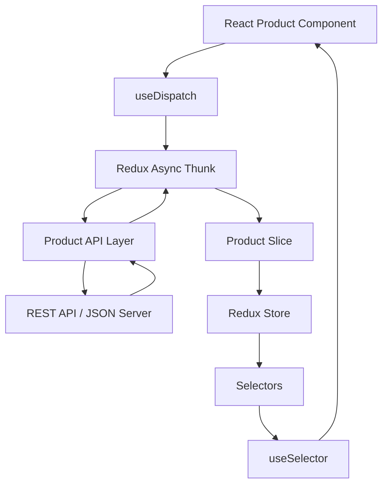
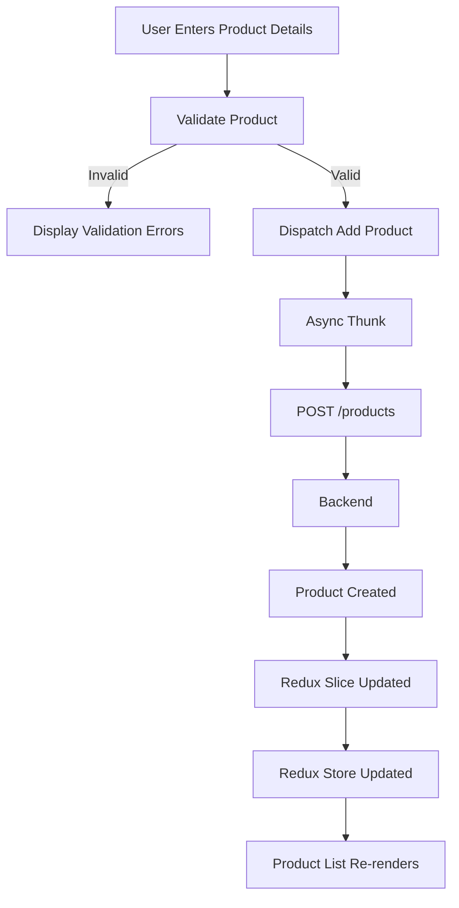
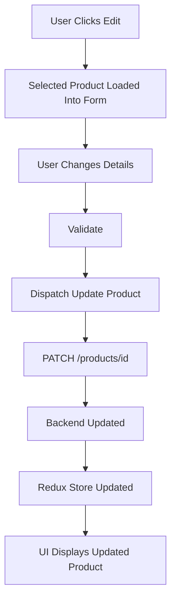
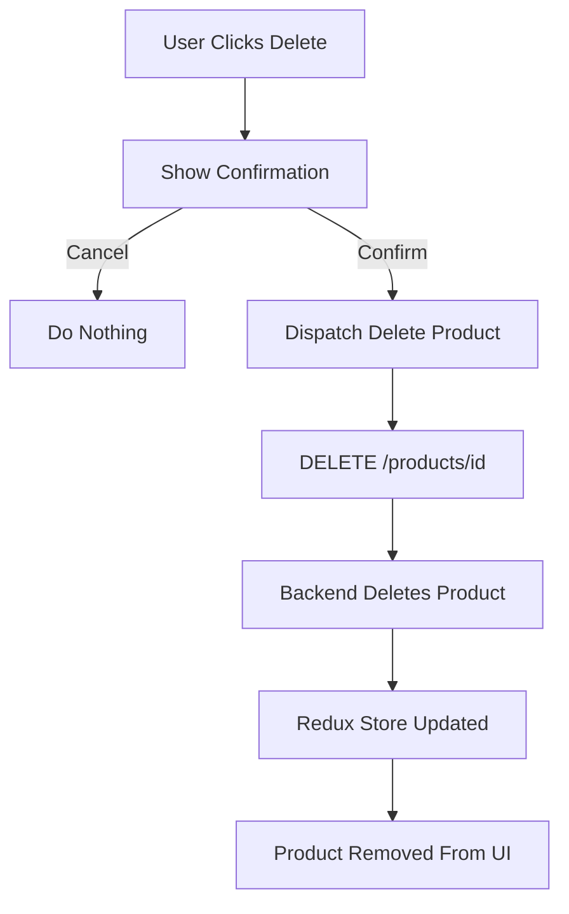

# Case Study: Product Inventory Management System

## 1. Project Title

**Product Inventory Management System using React and Redux Toolkit**

## 2. Problem Statement

A retail organization wants to develop a web-based **Product Inventory Management System**.

The application will allow an administrator to maintain product information such as:

* Product Name
* Category
* Price
* Quantity
* Status

The application must be developed using **React** for the UI and **Redux Toolkit** for centralized state management.

A REST API will be used to perform CRUD operations.

---

# 3. Technologies

| Technology    | Purpose                  |
| ------------- | ------------------------ |
| React         | Front-end UI             |
| Redux Toolkit | State management         |
| React Redux   | Connect React with Redux |
| Axios         | REST API communication   |
| JSON Server   | Mock backend REST API    |
| HTML          | Page structure           |
| CSS           | UI styling               |

---

# 4. Main Functional Requirements

The application must provide the following operations:

### Create Product

The administrator should be able to add a new product.

Required information:

* Product Name
* Category
* Price
* Quantity
* Status

After successful creation, the newly created product should automatically appear in the product list.

---

### Read Products

When the application loads, all products should be retrieved from the backend API.

Display the following information:

| Field        | Description              |
| ------------ | ------------------------ |
| Product Name | Name of product          |
| Category     | Product category         |
| Price        | Selling price            |
| Quantity     | Available stock          |
| Status       | Available / Out of Stock |
| Actions      | Edit / Delete            |

---

### Update Product

The administrator should be able to select an existing product and modify its details.

Clicking **Edit** should populate the form with the selected product information.

After updating:

* Send the updated information to the REST API.
* Update Redux state.
* Refresh the displayed product information.

---

### Delete Product

Each product should have a **Delete** option.

Before deletion, the user should see a confirmation such as:

**Are you sure you want to delete this product?**

If confirmed:

* Delete the product through the API.
* Remove the product from Redux state.
* Update the UI.

---

# 5. Product Data Model

A product should contain the following attributes:

| Attribute    | Type          | Required       |
| ------------ | ------------- | -------------- |
| ID           | String/Number | Auto generated |
| Product Name | String        | Yes            |
| Category     | String        | Yes            |
| Price        | Number        | Yes            |
| Quantity     | Number        | Yes            |
| Status       | String        | Yes            |

Example categories:

* Electronics
* Furniture
* Clothing
* Books
* Home Appliances

Possible status values:

* Available
* Out of Stock

---

# 6. Validation Requirements

The application should perform client-side validation before submitting the form.

### Product Name

* Required.
* Must not contain only spaces.
* Minimum 3 characters.
* Maximum 50 characters.

### Category

* Required.
* User must select a valid category.

### Price

* Required.
* Must be numeric.
* Must be greater than `0`.

### Quantity

* Required.
* Must be numeric.
* Cannot be negative.
* Only whole numbers should be accepted.

### Status

Only these values should be accepted:

* Available
* Out of Stock

---

# 7. Additional Business Rules

To make the case study slightly more realistic, implement these rules:

1. If quantity is `0`, status should automatically become **Out of Stock**.

2. If quantity is greater than `0`, status can be **Available**.

3. Product names should not be duplicated within the same category.

4. Price cannot be zero or negative.

5. Quantity cannot exceed `10,000`.

6. Delete should always require confirmation.

---

# 8. User Interface Requirements

The page should contain three major areas.

## Header

Display:

**Product Inventory Management**

Subtitle:

**React + Redux Toolkit CRUD Application**

---

# 9. Dashboard Summary

At the top of the application, show three summary cards.

### Total Products

Displays total number of products.

### Available Products

Displays products whose status is:

**Available**

### Out of Stock Products

Displays products whose status is:

**Out of Stock**

Example:

| Total Products | Available | Out of Stock |
| -------------: | --------: | -----------: |
|             18 |        14 |            4 |

---

# 10. Product Form

The form should contain:

| Field        | UI Control   |
| ------------ | ------------ |
| Product Name | Text Input   |
| Category     | Dropdown     |
| Price        | Number Input |
| Quantity     | Number Input |
| Status       | Dropdown     |

Buttons:

* Add Product
* Update Product
* Cancel

The **Update** and **Cancel** buttons should mainly be used during edit operations.

---

# 11. Product List

Products should be displayed using a table.

| Product      | Category    |     Price | Quantity | Status       | Actions       |
| ------------ | ----------- | --------: | -------: | ------------ | ------------- |
| MacBook Pro  | Electronics | ₹1,59,999 |        5 | Available    | Edit / Delete |
| Office Chair | Furniture   |   ₹12,999 |        0 | Out of Stock | Edit / Delete |
| React Book   | Books       |      ₹799 |       20 | Available    | Edit / Delete |

Use visual indicators for status.

For example:

**Available** → Green badge

**Out of Stock** → Red badge

---

# 12. Redux Architecture

Recommended Redux structure:

```text
React Component
        ↓
useDispatch()
        ↓
Redux Async Thunk
        ↓
API Layer
        ↓
REST API
        ↓
Async Thunk Result
        ↓
Redux Slice
        ↓
Redux Store Updated
        ↓
useSelector()
        ↓
React Component Re-renders
```

---

# 13. Redux State

The Redux product state should conceptually maintain:

```text
Product State

products
   Collection of products

loading
   Indicates API request status

error
   Stores API error information
```

Example conceptual structure:

```text
products
    ↓
Product 1
Product 2
Product 3

loading
    ↓
true / false

error
    ↓
null / error message
```

---

# 14. Redux Responsibilities

The application should use Redux Toolkit for the following responsibilities:

| Redux Concept | Responsibility              |
| ------------- | --------------------------- |
| Store         | Central application state   |
| Slice         | Product state management    |
| Async Thunk   | Asynchronous API operations |
| Reducer       | Modify Redux state          |
| Selector      | Read required state         |
| useDispatch   | Dispatch Redux actions      |
| useSelector   | Access Redux state          |

---

# 15. Required Async Operations

Four asynchronous Redux operations should exist conceptually.

### Fetch Products

Purpose:

Retrieve all products from the REST API.

Flow:

```text
Component
   ↓
Fetch Products
   ↓
API GET
   ↓
Redux Store
   ↓
Product List
```

---

### Add Product

```text
Product Form
   ↓
Validate
   ↓
Add Product Action
   ↓
POST API
   ↓
Redux Store Updated
   ↓
UI Updated
```

---

### Update Product

```text
Select Product
   ↓
Edit Product
   ↓
Form Populated
   ↓
Modify Information
   ↓
Update Action
   ↓
PATCH / PUT API
   ↓
Redux Store Updated
```

---

### Delete Product

```text
Click Delete
   ↓
Confirmation
   ↓
Delete Action
   ↓
DELETE API
   ↓
Redux Store Updated
   ↓
Product Removed
```

---

# 16. REST API Requirements

The backend should expose the following endpoints.

| HTTP Method | Endpoint         | Operation         |
| ----------- | ---------------- | ----------------- |
| GET         | `/products`      | Fetch products    |
| GET         | `/products/{id}` | Fetch one product |
| POST        | `/products`      | Add product       |
| PUT/PATCH   | `/products/{id}` | Update product    |
| DELETE      | `/products/{id}` | Delete product    |

---

# 17. Loading Handling

Whenever an API operation is running, the UI should show a loading indicator.

Example:

**Loading products...**

or

**Processing request...**

Users should not unknowingly submit the same request multiple times while an operation is in progress.

---

# 18. Error Handling

Errors must be displayed in a user-friendly manner.

Possible errors:

* Unable to fetch products.
* Unable to add product.
* Unable to update product.
* Unable to delete product.
* Server unavailable.
* Invalid product data.

The application should not display raw JavaScript exceptions to the user.

---

# 19. Empty State

When there are no products, instead of displaying an empty table, show:

**No products found.**

**Add your first product using the product form.**

---

# 20. Search Requirement

Add a search box:

**Search Product**

The administrator should be able to search products using:

* Product Name
* Category

Example:

```text
Search: Mac

MacBook Pro
Mac Mini
MacBook Air
```

Search can be performed against data already available in Redux.

---

# 21. Filter Requirement

Provide a status filter.

```text
All Products

Available

Out of Stock
```

Selecting **Available** should display only products with available stock.

---

# 22. Sorting Requirement

Provide sorting options for:

* Product Name
* Price Low to High
* Price High to Low
* Quantity Low to High
* Quantity High to Low

This gives students practice manipulating Redux-controlled data without necessarily making additional API calls.

---

# 23. Suggested Application Layout

```text
-------------------------------------------------------
                PRODUCT INVENTORY
          React + Redux Toolkit CRUD
-------------------------------------------------------

 Total Products       Available       Out of Stock
      20                 16                4


-------------------------------------------------------
                    PRODUCT FORM
-------------------------------------------------------

Product Name : _________________________________

Category     : [ Select Category ▼ ]

Price        : ______________

Quantity     : ______________

Status       : [ Available ▼ ]

       [ Add Product ]


-------------------------------------------------------
 Search: ________________       Status: [ All ▼ ]
-------------------------------------------------------

Product     Category      Price     Qty    Status
-------------------------------------------------------

MacBook     Electronics   159999     5    Available

Chair       Furniture      12999     0    Out of Stock

Book        Books             799    20    Available

                           [Edit] [Delete]
-------------------------------------------------------
```

---

# 24. Suggested Component Structure

```text
App
 │
 ├── Header
 │
 ├── DashboardSummary
 │
 ├── ProductForm
 │
 ├── ProductSearch
 │
 ├── ProductFilter
 │
 └── ProductList
        │
        └── ProductItem
```

---

# 25. Suggested Redux Folder Structure

```text
src
│
├── app
│     └── store
│
├── features
│     │
│     └── products
│           ├── productInitialState
│           ├── productApi
│           ├── productThunk
│           ├── productSlice
│           └── productSelectors
│
├── components
│     ├── ProductForm
│     ├── ProductList
│     ├── ProductItem
│     ├── ProductSearch
│     └── DashboardSummary
│
└── App
```

---

# 26. Complete CRUD Flow



---

# 27. Add Product Flow



---

# 28. Update Product Flow



---

# 29. Delete Product Flow



---

# 30. Student Assignment

Students should implement:

1. React application setup.
2. Redux Toolkit configuration.
3. Product Redux slice.
4. Async CRUD operations.
5. REST API integration.
6. Product form.
7. Product listing.
8. Add functionality.
9. Update functionality.
10. Delete functionality.
11. Validation.
12. Loading state.
13. Error handling.
14. Search.
15. Status filtering.
16. Sorting.
17. Dashboard summary.
18. Responsive CSS design.
